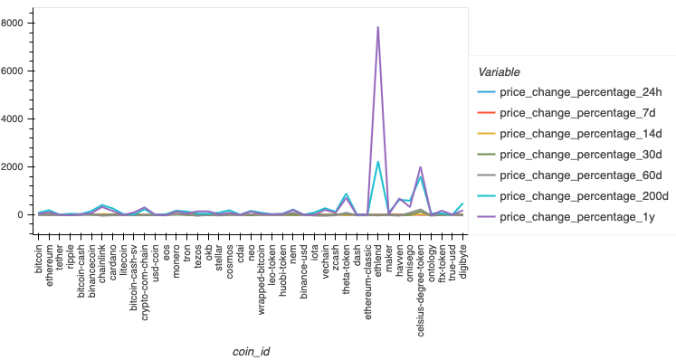
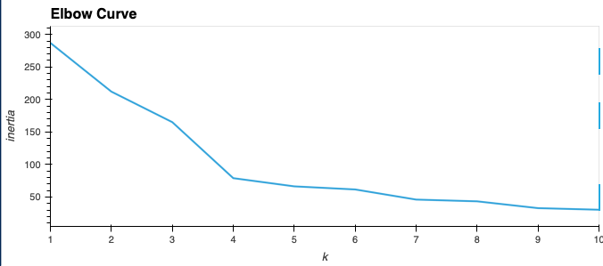
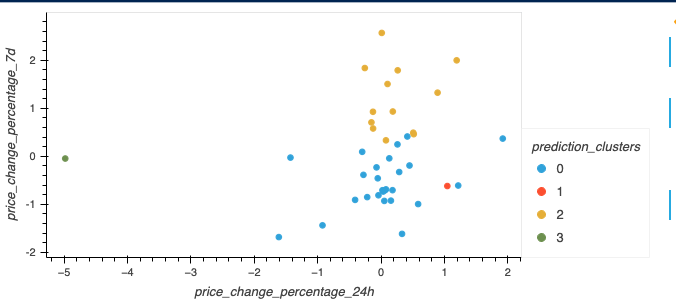
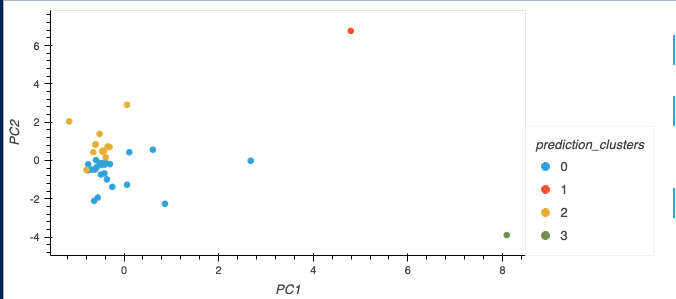

# CryptoClustering
Module 19 Challenge

This project utilizes unsupervised machine learning to analize crypocurrency fluctuation on a 24 hour and 7 day basis.

## Files
- Crypto_Clustering.ipynb
- Resources/crypto_market_data.csv
- images/*.png (for this readme file)

## Highlights

## Acknowlegements
- This project was created as part of the EdX Data Analytics Bootcamp

## Author
Andrew Lane, 2025 
[@andrewplane](https://github.com/andrewplane)